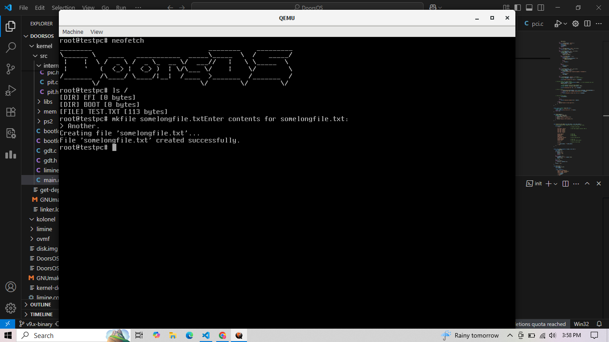

# What is DoorsOS 🚪?

DoorsOS is an x86_64 POSIX-Compilant Limine-based operating system in C. An active effort of making a full OS, with a simple and readable codebase.

# Preview of the OS




## Why make your own OS in [insert year]?

> because I can

Having a good time is my drive for this project + I learn a lot of cool low level stuff alongside that! And, also, I have the ambition to defeat Windows(this os doesn't give you freedom to be honest) and Linux(This is too cocky, like, yea, less manual, when you break the system via an unfogivable error)

## Roadmap & Todo's

* [X]  Initialise Limine
* [X]  Add Limine FrameBuffer
* [X]  Add flanterm
* [X]  Add umm_malloc
* [X]  Add ps2 keyboard(Note: USB works with it too)
* [X]  Add interrupts( essential stuff, unfortunately)
* [X]  Add SSE(It killed me)
* [X]  Add PIC (essential stuff, easy)
* [X]  Add a  allocator
* [X]  Add a sleep function
* [ ]  Add ahci{Contributions are open}
* [X]  Add a minimal bash v1
* [X]  Add ATA/PIO(Can also support sata)
* [X]  Add FAT32 Read
* [X]  Add fat32 write
* [X]  Add a PMM, PCI, And rpoper mapPage driver
* [ ]  Add Ext2
* [ ]  Add VFS
* [ ]  Add ELF support
* [ ]  Add Linux headers(Optional)
* [ ]  Add Mouse
* [ ]  Add Windows(not MS, the GUI )
* [ ]  Add Xorg or NanoX

## Resources

1. Umm_malloc :https://github.com/dimonomid/umm_malloc/(Used to handle previous versions)
2. Flanterm : https://codeberg.org/mintsuki/flanterm
3. Learn About VBE & some osdev stuff before limine : https://github.com/Supmaxred/NexOS
4. Mpaland's printf: [mpaland/printf: Tiny, fast, non-dependent and fully loaded printf implementation for embedded systems. Extensive test suite passing.](https://github.com/mpaland/printf)
5. limine: https://github.com/limine-bootloader
6. seepine's MarkDown(MD file)  Editor for VSCode

## Contributions

See docs/contributions.md

## Making

Limine

```
make limine/limine
```

Make CD: ``` make clean && make run```

For ATA(Reccomended): ```make clean && make run-hdd```
